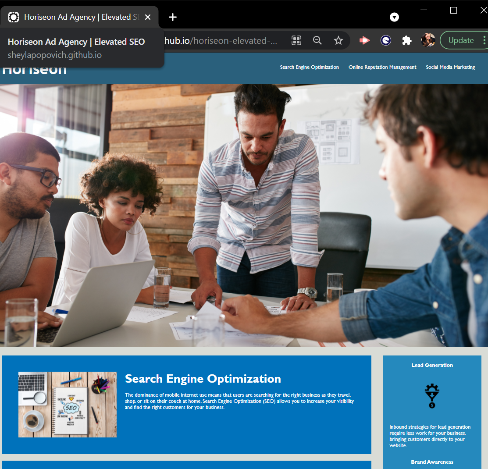

#   Horiseon Marketing Agency
#### _Elevated Search Engine Optimization_
 
 

## ⚙ About The Project 
While the client's existing website was aesthetically pleasing, there were several areas in need of revision in order to meet accessibility standards and incresae search engine optimization. With a focus on creating prime SEO I started with systematizing the structure of the website's HTML. In the HTML makeup I embedded the appropriate semantic elements, for example inserting a nav tag for the wesbite's navigation bar elements and adding section tags for the content. One of the first and foremost principle of web accessibilty is having alt attributes in an image tag to accomadate visually impaired users using screen readers. Each image tag in the HTML was revised with conise descriptive alt attributes. 
 
 
 In additon to imroving the HTML structure there were mutiple unessential classes in the CSS style sheet that I was able to consolidated for finer organization. By eliminating unnessary id's and merging classes I was able to produce the objective of having a website with "clean code" enhancing it's SEO. Lastly, to execute the ultimate goal of increasing the client's webpage SEO, I created a title tag with a keyword "SEO" attached to a hook word "Elevated" that would attract traffic and raise the websites ranking in SEO. This project was very insightful on learning how to practice clean coding by following semantic HTML, understanding classes/ids properties, and the importance of meeting accessibility standards which then will increase your search engine optimization. 
 
 

## ⚙ Acceptance Criteria Met 
 [ ✔ ] Meets accessibilty standards
 
 [ ✔ ] Semantic HTML elements
 
 [ ✔ ] Image emlements with alt attributes

 [ ✔ ] Heading attributes in sequential order

 [ ✔ ] Title element with concise descriptive title
 
 

 ## ⚙ Completed Version

### _This site was built using_ [GitHub Pages.](https://sheylapopovich.github.io/horiseon-elevated-marketing/)

